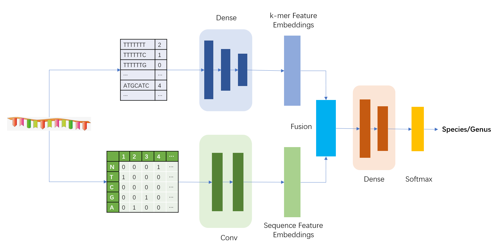
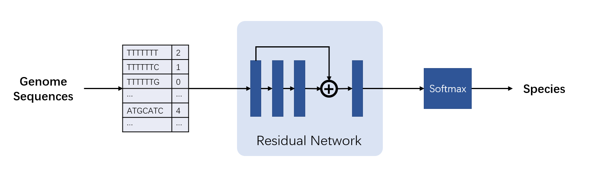

# Xlassify

Fast and accurate taxonomic classification of bacteria genomes is a key step in human gut microbiome analysis. Here we propose Xlassify, an alignment-free deep-learning model that is specifically trained to classify human gut bacteria.

Xlassify demonstrated 98% accuracy in UHGG genomes dataset and \~90% accuracy on an independent testset of 76 gut bacterial genomes isolated from healthy Chinese individuals. Better than alignment-based methods such as GTDBTk, Xlassify requires only <4GB of memory and reaches thirty-second-per-genome speed on a single CPU.


### Architecture

16S model:


genome model:



### Descriptions  

The most important files in this projects are as follow:
```bash
.
├── 16s                         # Xlassify 16s model
│   ├── data                    # 16s dataset
│   ├── slurm_split_data        # processed 16s data
│   ├── kmer.py                 # create K-mer feature
│   ├── model_chg3.py           # 16s model
│   ├── model_chg_mnb.py        # naive Bayesian classifier model
│   ├── model_chg_rdp.py        # RDP classifier model
│   ├── model_chg_rf.py         # random forest model
│   ├── model.py                # implementation of 16s model
│   └── fold.sh                 # train scripts for 16s model and other baselines
├── genome                      # Xlassify genome model
│   ├── data                    # genome dataset
│   ├── datasetG7m.py           # create K-mer feature
│   ├── model.py                # implementation of genome model
│   ├── trainer7m.py            # genome model
│   └── run.sh                   # train scripts
├── docs
└── README.md
```


### Installation

We provide two ways to install Xlassify locally via pip or Docker.

From pip:

```bash
pip install Xlassify
```

From Docker:
```bash
docker pull SenseTime-Knowledge-Mining/Xlassify
```


### Usage
```
usage: xlassify [-h] [-m MODEL_NAME] [-i INPUT_PATH]
                [-f INPUT_FILE_LST [INPUT_FILE_LST ...]] [-s SAVE_PATH]
                [-r SAVE_FILE] [--save_kmer SAVE_KMER] [-b BATCH] [-k K]
                [--nproc NPROC]

optional arguments:
  -h, --help            show this help message and exit
  -m MODEL_NAME, --model_name MODEL_NAME
                        Choose a model from {compute_kmer, species_genome,
                        genus_full, species_full}. Default: species_genome
  -i INPUT_PATH, --input_path INPUT_PATH
                        The path of input fasta file.
  -f INPUT_FILE_LST [INPUT_FILE_LST ...], --input_file_lst INPUT_FILE_LST [INPUT_FILE_LST ...]
                        The list of input file.
  -s SAVE_PATH, --save_path SAVE_PATH
                        The path of save file. Default: ./results_genome
  -r SAVE_FILE, --save_file SAVE_FILE
                        The path of results file. Default: res.csv
  --save_kmer SAVE_KMER
                        Save kmer or not {0,1}. Default: 1
  -b BATCH, --batch BATCH
                        The batch of prediction.
  -k K                  The k of kmer. Default: 7
  --nproc NPROC         The number of CPUs to use. Default: 1
```


### Trianing from scratch

Set up environments:
```bash
conda create -n py37 python=3.7.1
conda activate py37
pip install -r requirements.txt
```

1. For 16S model, modify the parameters in `16s/fold.sh` file:
```
k=7                 # kmer size
t="t"               # logname marker
model="CNN+MLP"     # options are CNN, MLP, CNN+MLP, RF, and RDP
th=10               # k-fold cross-validation
data_type="full"    # full or partial
```

Then execute the following scripts to train and test 16S model:
```bash
cd 16s
chmod +777 fold.sh
./fold.sh
```

2. For genome model, just execute the following scripts to train and test genome model:
```bash
cd genome
chmod +777 run.sh
./run.sh
```

### Datasets

Both 16S rRNA dataset and Genome dataset used in this study are from the UHGG which is publicly available. The data we used to train out model can be found in the `data` directory under the corresponding model folder (`16s` or `genome`).

We also provide the processed k-mer feature matrix data, which can be downloaded from [Dropbox](https://www.dropbox.com/s/oxh6fb52peqfuum/kmer7_mat_ge5_le50_dedup.npy?dl=0), the total download size for this is around 3.3GB.
